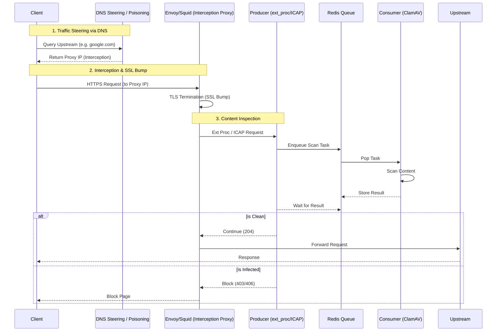

# Virus Scanner

Redis-based virus scanning service with Producer (Envoy ext_proc) and Consumer (ClamAV worker) components.

## Design Philosophy: Flexibility First

NCS (Network Connectivity Service) は、純粋なセキュリティツールである以上に、**「フレキシビリティ（柔軟性）」**を最優先の設計思想としています。

- **デプロイの柔軟性**: Producer (Sidecar/Proxy) と Consumer (Scalable Worker) を分離し、環境に応じて最適な構成を選択可能。
- **データソースの柔軟性**: `DataProvider` 戦略により、ストリーム、ディスク、インラインなど多様なデータ供給元に対応。
- **アーキテクチャの柔軟性**: 全てを `STREAM` プロトコルに統一。将来的に異なるスキャンエンジンや伝送方式への差し替えが容易。
- **ハードウェアの柔軟性**: AMD64/ARM64 双方へのネイティブ対応により、コスト効率の高いインフラ（ARMなど）を自由に選択可能。
- **誘導の柔軟性**: DNSポイズニング（DNSによる誘導）や透過型プロキシ構成など、既存ネットワークへの多様な挿入手法に対応。
- **ポリシーの柔軟性**: 信頼ドメインに基づく優先度制御（Priority-based Scanning）により、セキュリティと効率性のバランスを最適化可能。

## Core Capabilities (主要機能)

NCS は、以下のコア機能を通じてセキュアで柔軟なネットワーク環境を提供します。

- **インターネット接続の高度な制御**: Envoy Gateway との統合により、ポリシーに基づいたインターネット接続の可視化と制御（Egress コントロール）を実現します。
- **統合型ウイルススキャン対策**: ストリームベースのスキャンエンジンにより、データ転送を妨げることなく、リアルタイムでウイルス検知・防御を実行します。

## Architecture Overview



## Components

### Producer (Interception Proxy / External Processor)

いわゆる **Interception Proxy** として動作し、TLS終端（SSL Bump）により暗号化されたトラフィックを復号してスキャンを実行します。 Envoy の `ext_proc` フィルター、または Squid 等の ICAP サービスとして動作し、リクエスト/レスポンスボディをインターセプトします。

- **役割**: TLS終端、リクエストボディのRedisキュー投入、スキャン結果に基づくフロー制御
- **実装**: gRPC service / ICAP Server (`src/aether_platform/virusscan/producer/main.py`)
- **デプロイ**: Envoy Gateway の Sidecar、または独立した透過プロキシサービス
- **ポート**: 50051 (gRPC), 1344 (ICAP), 8080 (metrics)

具体的な設定例については、[Envoy Interception Example](docs/examples/envoy-interception/README.md)（`/tmp/envoy-test` より移行）を参照してください。

### Consumer (Request Handler)

RedisキューからウイルススキャンタスクをPopし、Pod内のClamAV (clamd) サイドカーへリクエストを転送する Request Handler です。

- **役割**: Redisキューからタスクを取得し、ClamAV でスキャン
- **実装**: Python worker with Dependency Injector (`src/aether_platform/virusscan/consumer/main.py`)
- **接続**: `tcp://host:port` または `unix:///path/to/socket` 形式の CLAMD_URL に対応
- **デプロイ**: KEDA ScaledObject による自動スケーリング対応

単一の Python パッケージ `aether-platform` で、optional dependencies (extras) により役割を分離：

```toml
[project.scripts]
virus-scanner-handler = "aether_platform.virusscan.consumer.main:main"
virus-scanner-producer = "aether_platform.virusscan.producer.main:serve"
```

### Installation

```bash
# Install Consumer dependencies only
uv pip install '.[consumer]'

# Install Producer dependencies only
uv pip install '.[producer]'

# Install all dependencies
uv pip install '.[all]'
```

## Docker Build

Use `--build-arg FLAVOR=<flavor>` to build optimized images:

```bash
# Producer-only image (for Envoy sidecar)
docker build --build-arg FLAVOR=producer -t virus-scanner:producer .

# Consumer-only image (for ClamAV workers)
docker build --build-arg FLAVOR=consumer -t virus-scanner:consumer .

# All-in-one image (default)
docker build -t virus-scanner:all .
```

## Usage

### Producer (Envoy ext_proc)

```bash
docker run -p 50051:50051 -p 8080:8080 \
  -e REDIS_HOST=redis \
  virus-scanner:producer virus-scanner-producer
```

### Consumer (ClamAV Worker)

```bash
docker run \
  -e REDIS_HOST=redis \
  -e CLAMD_URL=tcp://127.0.0.1:3310 \
  virus-scanner:consumer virus-scanner-handler --redis-host redis --clamd-url tcp://clamav:3310
```

## Local Development

### Consumer

```bash
# Install dependencies
uv pip install -e '.[consumer]'

# Run with Docker Compose
docker compose up
```

### Producer

```bash
# Install dependencies
uv pip install -e '.[producer]'

# Generate Envoy protos (one-time)
./generate_protos.sh

# Run Producer
virus-scanner-producer
```

## Testing

### Unified Test Scenarios

We provide two standardized scenarios for integration testing:

#### A. Host-based Local Testing (`test-local`)

Requires Redis and ClamAV (clamd) to be running on the host (e.g., via Docker). Components run directly via `uv run`.

```bash
# Ensure infrastructure is up
docker compose up -d redis clamav

# Run tests
make test-local
```

#### B. Container-based Full Stack Testing (`test-docker`)

Runs everything inside Docker containers, mimicking the production environment.

```bash
make test-docker
```

## Environment Variables

All components leverage Click's native environment variable handling.

| Variable        | Default                | Description                    |
| :-------------- | :--------------------- | :----------------------------- |
| `REDIS_HOST`    | `localhost`            | Redis server address           |
| `REDIS_PORT`    | `6379`                 | Redis server port              |
| `CLAMD_URL`     | `tcp://127.0.0.1:3310` | ClamAV daemon connection URL   |
| `SCAN_MOUNT`    | `/tmp/virusscan`       | Host path for file-based scans |
| `PRODUCER_PORT` | `50051`                | Producer gRPC server port      |

## References

- [Producer README](src/aether_platform/virusscan/producer/README.md) - Envoy integration guide
- [Helm Chart](../helm/README.md) - Kubernetes deployment configuration
- [E2E Tests](../../e2e/README.md) - Integration testing guide
