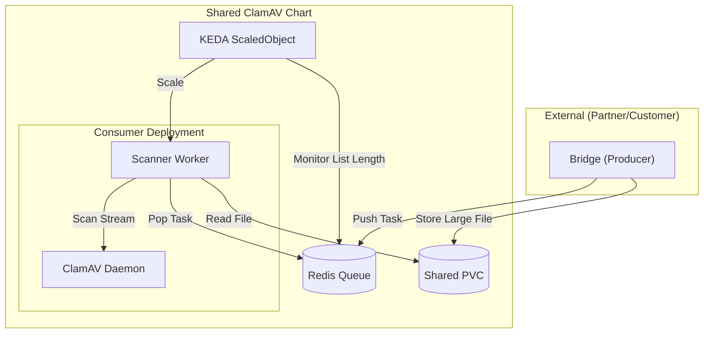

# Shared ClamAV Helm Chart

A Helm chart for deploying a shared ClamAV scanning service with KEDA-based autoscaling and Redis queuing.

## Upstream

This chart is based on the following experiment repository:
`git@github.com:aether-platform/helm-ncs-queue-based-clamav.git`

## Architecture

This chart deploys:

- **Consumer Deployment**:
  - **Scanner Container**: Python worker that pops tasks from Redis.
  - **ClamAV Container**: Sidecar running the ClamAV daemon (`clamd`), accessed via `localhost:3310`.
- **Redis**: Deployed as a subchart (Bitnami) to handle the task queue.
- **KEDA ScaledObject**: Autoscales the Consumer deployment based on the Redis queue length.
- **PVC**: Shared ReadWriteMany (RWX) volume for handling large files (>10MB).



**Note**: The **Bridge** (Producer) component is **external** to this chart and should be deployed separately (e.g., in a tenant namespace), configured to point to this Redis and mount the same shared volume.

## Prerequisites

- Kubernetes Cluster 1.19+
- Helm 3.0+
- **KEDA** installed in the cluster.
- **ReadWriteMany (RWX) StorageClass** available (e.g., NFS, EFS) if handling large files.

## Installation

1. **Update Dependencies** (downloads Redis chart):

   ```bash
   helm dependency update sre/helm/ncs/shared-clamav
   ```

2. **Install Chart**:
   ```bash
   helm install shared-clamav sre/helm/ncs/shared-clamav \
     --set autoscaling.minReplicas=1 \
     --namespace shared-services --create-namespace
   ```

## Configuration

| Parameter                      | Description                    | Default                  |
| ------------------------------ | ------------------------------ | ------------------------ |
| `image.consumer.repository`    | Scanner image repo             | `shared-clamav-consumer` |
| `image.clamav.repository`      | ClamAV image repo              | `clamav/clamav`          |
| `redis.enabled`                | Enable Redis subchart          | `true`                   |
| `autoscaling.enabled`          | Enable KEDA autoscaling        | `true`                   |
| `autoscaling.minReplicas`      | Minimum Consumer replicas      | `0`                      |
| `autoscaling.maxReplicas`      | Maximum Consumer replicas      | `10`                     |
| `autoscaling.redis.listLength` | Target queue items per replica | `5`                      |
| `storage.pvc.storageClass`     | StorageClass for shared volume | `""` (Must support RWX)  |
| `storage.pvc.size`             | Size of shared volume          | `10Gi`                   |

## Scaling Behavior

KEDA monitors the `scan_priority` and `scan_normal` lists in Redis.
If the backlog exceeds `autoscaling.redis.listLength` (default 5) per replica, KEDA scales up the Consumer deployment (adding more ClamAV workers) up to `maxReplicas`.
