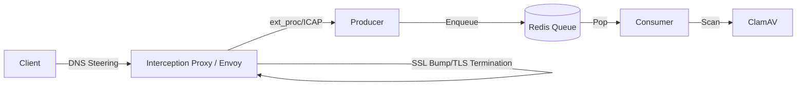

# Virus Scanner Producer (Envoy External Processor)

gRPC service that acts as an Envoy External Processor for virus scanning.

## Architecture

Producer integrates with Envoy or ICAP-capable proxies (e.g., Squid) as an interception point:



## Features

- **Multi-Protocol Interception**: Supports both gRPC `ext_proc` (Envoy) and ICAP (Squid/Standard Proxy).
- **SSL Bump Compatibility**: Designed to work with TLS terminating proxies.
- **Priority Queueing**: Supports `X-Priority: high` header for urgent scans.
- **Large File Handling**: Files exceeding threshold stored on shared filesystem.
- **Synchronous Scanning**: Blocks request/response until scan result is determined.
- **Metrics & Health**: Prometheus endpoints and `/health` checks.

## Running

### Development

```bash
# Install with Producer dependencies
uv pip install -e '.[producer]'

# Generate protos first (one-time)
./generate_protos.sh

# Run Producer
uv run virus-scanner-producer
```

### Docker

Build with specific flavor to reduce image size:

```bash
# Build Producer-only image
docker build --build-arg FLAVOR=producer -t virus-scanner:producer .

# Build Consumer-only image
docker build --build-arg FLAVOR=consumer -t virus-scanner:consumer .

# Build with all dependencies (default)
docker build -t virus-scanner:all .

# Run as Producer
docker run -p 50051:50051 -p 8080:8080 \
  -e REDIS_HOST=redis \
  virus-scanner:producer virus-scanner-producer

# Run as Consumer
docker run \
  -e REDIS_HOST=redis \
  virus-scanner:consumer virus-scanner-handler --redis-host redis
```

## Environment Variables

- `REDIS_HOST`: Redis hostname (default: localhost)
- `REDIS_PORT`: Redis port (default: 6379)
- `SCAN_TMP_DIR`: Temp directory for large files (default: /tmp/virusscan)
- `SCAN_FILE_THRESHOLD_MB`: File size threshold (default: 10)

## Envoy Configuration

### Basic configuration (ext_proc)

Add the `ext_proc` filter to your `HttpConnectionManager`:

```yaml
http_filters:
  - name: envoy.filters.http.ext_proc
    typed_config:
      "@type": type.googleapis.com/envoy.extensions.filters.http.ext_proc.v3.ExternalProcessor
      grpc_service:
        envoy_grpc:
          cluster_name: aether_platform.virusscan_producer
      processing_mode:
        request_header_mode: SEND
        request_body_mode: BUFFERED
        response_header_mode: SEND
        response_body_mode: BUFFERED
      message_timeout: 30s
      processing_timeout: 30s
```

### Cluster definition

```yaml
clusters:
  - name: aether_platform.virusscan_producer
    type: STATIC
    connect_timeout: 0.25s
    http2_protocol_options: {}
    load_assignment:
      cluster_name: aether_platform.virusscan_producer
      endpoints:
        - lb_endpoints:
            - endpoint:
                address:
                  socket_address:
                    address: 127.0.0.1
                    port_value: 50051
```

## Advanced Use Cases

### Selective Scanning (Per-Route)

You can disable scanning for specific routes using `typed_per_filter_config`:

```yaml
- match: { prefix: "/safe" }
  route: { cluster: service_a }
  typed_per_filter_config:
    envoy.filters.http.ext_proc:
      "@type": type.googleapis.com/envoy.extensions.filters.http.ext_proc.v3.ExtProcPerRoute
      disabled: true
```

### Response Codes

When a virus is detected, the Producer returns a `ProcessingResponse` with an `immediate_response`.

- **Status Code**: `406 Not Acceptable` (default)
- **Headers**: `X-Virus-Infected: true`
- **Body**: Details about the detected virus.

## Implementation Analysis

### ICAP vs. Envoy ext_proc

| Feature             | ICAP (Legacy)                     | Envoy ext_proc (Current)                  |
| :------------------ | :-------------------------------- | :---------------------------------------- |
| **Protocol**        | HTTP-like (RFC 3507)              | gRPC (Bidirectional Streaming)            |
| **Type Safety**     | Low (Text-based)                  | High (Protobuf)                           |
| **Filter Control**  | Limited to REQMOD/RESPMOD         | Full control over Headers, Body, Trailers |
| **Performance**     | Higher overhead for large streams | Efficient binary streaming                |
| **Standardization** | Mature but stagnant               | Modern, cloud-native standard             |

### Processing Modes

| Mode          | Characteristics                          | Pros                                                        | Cons                                                     |
| :------------ | :--------------------------------------- | :---------------------------------------------------------- | :------------------------------------------------------- |
| **Buffered**  | Wait for full body before scan (Current) | Simplest implementation, prevents "partial leaked" viruses. | Memory intensive for large files, adds TTFB latency.     |
| **Streaming** | Scan chunks in real-time (Planned)       | Lowest latency, handles multi-GB files.                     | Complex state management, risk of partial data delivery. |

### Architectural Trade-offs

#### Sidecar Deployment (Current)

- **Pro**: **Isolation**. One tenant's large upload doesn't block another tenant. Security boundaries are clear.
- **Pro**: **Simplicity**. No complex multi-tenant routing logic inside the producer.
- **Con**: **Resource Overhead**. Each tenant gateway consumes extra memory/CPU for the sidecar.

#### Centralized Cluster

- **Pro**: **Efficiency**. Better resource utilization for low-traffic tenants.
- **Con**: **Complexity**. Requires robust multi-tenant queueing and rate-limiting to prevent "noisy neighbor" issues.

## Task Format (Internal)

Producer enqueues tasks to Redis:

```
taskID|MODE|TIMESTAMP|CONTENT
```

- **MODE**: `BODY` (inline) or `PATH` (file path)
- **TIMESTAMP**: nanoseconds since epoch
- **CONTENT**: content string or file path
